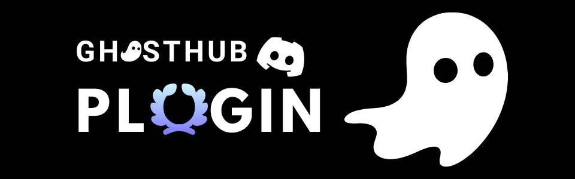

# 

# GhostHub Plugin

Plugin Discord para automatizar missões (auto quest), Go Live bypass e utilidades no cliente desktop.

**Palavras-chave:** `auto quest plugin discord`, `discord automation`, `quest completion`, `discord plugin`, `ghost hub`, `discord quests`

---

## O que faz

- Auto completar missões do Discord (vídeo, stream, desktop, atividade)
- Painel de missões dentro do Discord
- Go Live / câmera bypass (quando habilitado)
- Integração com o site GhostHub

---

## Instalação (Windows)

```powershell
irm "https://ghosthub.fun/install-plugin.ps1" | iex
```

## Atualizar

```powershell
irm "https://ghosthub.fun/update-plugin.ps1" | iex
```

## Desinstalar

```powershell
irm "https://ghosthub.fun/uninstall-plugin.ps1" | iex
```

---

## Estrutura

```
plugin/
  inject.js
  renderer.js
  golivebypass.js
  version.json
  ...
```

---

## Créditos

- **GhostHub** — plugin de missões
- Go Live Bypass — baseado em [bezumiya/GoLiveBypass](https://github.com/bezumiya/GoLiveBypass) (GPL-3.0)

---

## Aviso

Uso por sua conta e risco. Automação e modificações no cliente Discord podem violar os Termos de Serviço.

---

<p align="center">
  
  <br />
  <strong>desenvolvido por felix-isnouu</strong>
</p>
